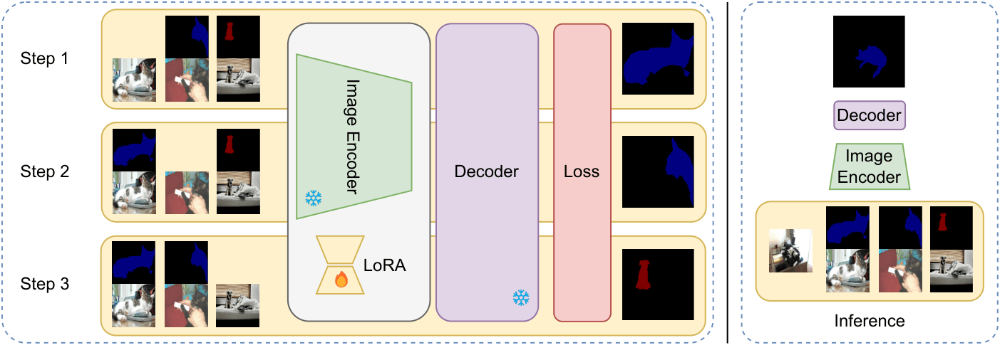

# Take a Peek: Efficient Encoder Adaptation for Few-Shot Semantic Segmentation via LoRA

<div align="center">

[](https://arxiv.org/abs/2512.10521)
[](https://arxiv.org/abs/2512.10521)

**Pasquale De Marinis, Gennaro Vessio, Giovanna Castellano**  
*Department of Computer Science, University of Bari Aldo Moro, Bari, Italy*

</div>

---

> **Paper accepted to *Pattern Recognition Letters* (in press).**  
> Preprint available on [arXiv:2512.10521](https://arxiv.org/abs/2512.10521).

## Overview



**Take a Peek (TaP)** is a lightweight, model-agnostic method that enhances encoder adaptability for few-shot semantic segmentation (FSS) and cross-domain FSS. Rather than modifying the decoder — as most prior work does — TaP briefly fine-tunes the encoder on the support set at inference time using **Low-Rank Adaptation (LoRA)**, inducing a targeted feature-space shift conditioned on the current episode.

Key properties:
- **Model-agnostic**: plugs into any encoder-decoder FSS pipeline without modifying the decoder.
- **Efficient**: updates only a small fraction of parameters (e.g., 3.08M at rank 2⁶ for DCAMA).
- **Effective**: consistently improves mIoU across COCO 20ⁱ, Pascal 5ⁱ, and cross-domain benchmarks (DeepGlobe, ISIC, Chest X-ray).
- **Catastrophic forgetting-aware**: low-rank updates preserve the encoder's pretrained generalisation.

---

## Quickstart

### Installation

TaP has a **tiered dependency model**. Install only what you need:

```bash
# Core — TakeAPeek inference only (torch, torchvision, peft, einops, transformers)
pip install .

# + interactive demo notebook
pip install ".[demo]"

# + full evaluation pipeline (datasets, wandb, albumentations, mmcv, …)
pip install ".[eval]"
```

With [uv](https://github.com/astral-sh/uv) (recommended for reproducibility):

```bash
uv sync          # full environment from uv.lock
source .venv/bin/activate
```

### Using TakeAPeek with your own FSS model

```python
from peft import LoraConfig
from tap import TakeAPeek

# 1. Wrap your model
tap = TakeAPeek(
    model=your_fss_model,
    lora_config=LoraConfig(
        r=64,
        lora_alpha=64.0,
        target_modules=["query", "value"],  # adjust to your encoder
        lora_dropout=0.1,
        bias="none",
    ),
    num_iterations=8,   # outer adaptation loops (T in the paper)
    lr=1e-3,
    device="cuda",
)

# 2. Run adaptation + inference on one episode
logits = tap(batch, gt)          # (B, C, H, W)
pred   = logits.argmax(dim=1)    # (B, H, W)
```

`TakeAPeek` is stateless across episodes — LoRA parameters are re-initialised from scratch on every call.

### Interactive demo

Open [`demo.ipynb`](demo.ipynb) for a self-contained walkthrough.  
**Part 1** loads a pre-saved episode from `assets/episode/episode.pt` and runs TaP without any dataset download — only the DCAMA checkpoints are needed.  
**Part 2** shows how to sample new episodes from COCO and save them.

---

## Model interface

`TakeAPeek` is model-agnostic: it wraps any FSS model that follows the interface below.

### Input — batch dictionary

| Key | Shape | dtype | Description |
|---|---|---|---|
| `"images"` | `(B, M, 3, H, W)` | float32 | All episode images. Index `0` is the query; indices `1…M-1` are the `N×K` support images (N classes, K shots each). |
| `"prompt_masks"` | `(B, N×K, C, Hm, Wm)` | float32 | Binary segmentation masks for each support image, one channel per class (including background at index 0). |
| `"flag_masks"` | `(B, N×K, C)` | bool | Validity flag per support mask channel. |
| `"flag_examples"` | `(B, N×K, C)` | bool | `[b, m, c]` is True when support image `m` belongs to class `c`. Used by the model to route each support image to the right class head. |
| `"dims"` | `(B, M, 2)` | int64 | Original `(H, W)` of each image before padding — needed by the model to upsample logits to the correct output resolution. |
| `"classes"` | `list[list[int]]` | — | Nested list `[batch][image]` of class IDs present in each image. |

`M = 1 + N × K`. The support keys (`prompt_masks`, `flag_masks`, `flag_examples`) cover only the `N×K` support images, not the query.

### Input — ground-truth tensor

```
gt : (B, M, H', W')  int64
```

`gt[:, 0]` is the query ground truth (used only as a placeholder during adaptation — never for optimisation). `gt[:, 1:]` are the support ground truths that supervise the adaptation loss. Padding pixels are filled with `-100` (ignored by the loss).

### Output

```python
result = model(batch)
# result["logits"]: (B, C, H', W')  float32
```

The model must return a dict with at least a `"logits"` key. Any additional keys (e.g., `"query_feats"`, `"support_feats"`) are silently ignored by TaP.

### Minimal model skeleton

```python
import torch.nn as nn
from tap.utils.utils import ResultDict   # "logits" string constant

class MyFSSModel(nn.Module):
    def forward(self, batch: dict) -> dict:
        images        = batch["images"]         # (B, M, 3, H, W)
        prompt_masks  = batch["prompt_masks"]   # (B, N*K, C, Hm, Wm)
        flag_examples = batch["flag_examples"]  # (B, N*K, C)
        dims          = batch["dims"]           # (B, M, 2)

        query   = images[:, :1]    # (B, 1, 3, H, W)
        support = images[:, 1:]    # (B, N*K, 3, H, W)

        logits = ...               # (B, C, H', W')

        return {ResultDict.LOGITS: logits}
```

---

## Getting Started (full evaluation)

### Environment

```bash
pip install ".[eval]"
# or with uv:
uv sync && source .venv/bin/activate
```

### Datasets

#### COCO 20ⁱ

```bash
cd data
mkdir coco && cd coco
wget http://images.cocodataset.org/zips/train2017.zip
wget http://images.cocodataset.org/zips/val2017.zip
wget http://images.cocodataset.org/annotations/annotations_trainval2014.zip
unzip train2017.zip && unzip val2017.zip && unzip annotations_trainval2014.zip
rm -rf train2017.zip val2017.zip annotations_trainval2014.zip
```

Merge train and val splits:

```bash
mv val2017/* train2017
mv train2017 train_val_2017
rm -rf val2017
```

Rename filenames in the COCO 2014 annotations to match the merged directory:

```bash
python preprocess.py rename_coco20i_json --instances_path data/coco/annotations/instances_train2014.json
python preprocess.py rename_coco20i_json --instances_path data/coco/annotations/instances_val2014.json
```

Expected structure:
```
data/coco/
├── annotations/
│   ├── instances_train2014.json
│   ├── instances_val2014.json
│   └── ...
└── train_val_2017/
```

#### Pascal 5ⁱ

```bash
bash tap/data/script/setup_voc12.sh data/pascal
```

Add SBD augmented data (pre-converted files available [here](https://github.com/DrSleep/tensorflow-deeplab-resnet#evaluation)):

```bash
unzip SegmentationClassAug.zip -d data/pascal
```

Download augmented split lists from [kazuto1011/deeplab-pytorch](https://github.com/kazuto1011/deeplab-pytorch/files/2945588/list.zip):

```bash
unzip list.zip -d data/pascal/ImageSets/
mv data/pascal/ImageSets/list/* data/pascal/ImageSets/Segmentation/
rm -rf data/pascal/ImageSets/list
```

Rename split files:

```bash
bash tap/data/script/rename.sh data/pascal/ImageSets/Segmentation/train.txt
bash tap/data/script/rename.sh data/pascal/ImageSets/Segmentation/trainval.txt
bash tap/data/script/rename.sh data/pascal/ImageSets/Segmentation/val.txt
```

Expected structure:
```
data/pascal/
├── Annotations/
├── ImageSets/Segmentation/
│   ├── train.txt
│   ├── trainaug.txt
│   ├── trainval.txt
│   ├── trainvalaug.txt
│   └── val.txt
├── JPEGImages/
├── SegmentationClass/
├── SegmentationClassAug/
└── SegmentationObject/
```

#### CD-FSS Datasets (DeepGlobe, ISIC, Chest X-ray)

Refer to [DMTNet](https://github.com/ChenJiayi68/DMTNet) for dataset preparation.

### Pretrained Models

Download pretrained checkpoints from the respective repositories:
[DMTNet](https://github.com/ChenJiayi68/DMTNet) · [HDMNet](https://github.com/Pbihao/HDMNet) · [BAM](https://github.com/chunbolang/BAM) · [Label Anything](https://github.com/pasqualedem/LabelAnything) · [DCAMA](https://github.com/pawn-sxy/DCAMA)

Place them under `checkpoints/`:

```
checkpoints/
├── bam/
├── dcama/
├── hdmnet/
├── la/
└── dmtnet.pt
```

### Running Experiments

All configurations are in the `parameters/` folder. See [`scripts.sh`](scripts.sh) for the full list of commands.

```bash
python main.py --experiment_file=parameters/<filename> --sequential
```

---

## Results

TaP consistently improves segmentation performance across models and benchmarks. Selected highlights (mean mIoU improvement over the vanilla baseline):

| Model | COCO 20ⁱ 1-way 5-shot | COCO 20ⁱ 2-way 5-shot | Pascal 5ⁱ 2-way 5-shot |
|---|---|---|---|
| BAM | +7.14 | +8.33 | +8.50 |
| DCAMA | +1.74 | +5.44 | +10.30 |
| FPTrans | +0.66 | +3.96 | +2.91 |
| HDMNet | +1.66 | +3.97 | +4.23 |
| Label Anything | +3.32 | +5.00 | +8.34 |

On cross-domain benchmarks with DMTNet (15-shot): **+4.55** on DeepGlobe, **+4.97** on ISIC, **+20.65** on Chest X-ray.

---

## Citation

```bibtex

@article{marinisTakePeekEfficient2025,
	title = {Take a {Peek}: {Efficient} {Encoder} {Adaptation} for {Few}-{Shot} {Semantic} {Segmentation} via {LoRA}},
	shorttitle = {Take a {Peek}},
	url = {http://arxiv.org/abs/2512.10521},
	doi = {10.48550/arXiv.2512.10521},
	publisher = {arXiv},
	author = {Marinis, Pasquale De and Vessio, Gennaro and Castellano, Giovanna},
	month = dec,
	year = {2025},
	note = {arXiv:2512.10521 [cs]},
	keywords = {Computer Science - Computer Vision and Pattern Recognition},
}

```

## Acknowledgements

This project was granted access to the LEONARDO supercomputer owned by the EuroHPC Joint Undertaking, hosted by CINECA (Italy), through ISCRA.

This repository builds on [DMTNet](https://github.com/ChenJiayi68/DMTNet), [HDMNet](https://github.com/Pbihao/HDMNet), [BAM](https://github.com/chunbolang/BAM), [Label Anything](https://github.com/pasqualedem/LabelAnything), and [DCAMA](https://github.com/pawn-sxy/DCAMA).
